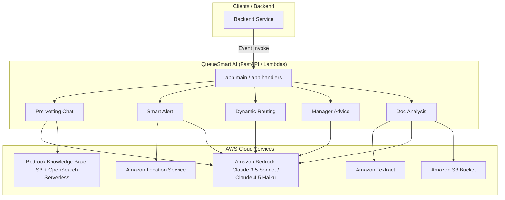

# QueueSmart AI Codebase Analysis

Welcome to the deep scan and architectural analysis of the **QueueSmart AI** engineering codebase. This document outlines the system architecture, component breakdown, AWS integrations, and data flows within the repository.

---

## 1. Executive Summary

**QueueSmart** is a smart, AI-driven queue management system. Unlike traditional wait-time estimators, QueueSmart uses **Amazon Bedrock (Claude)** to actively manage, route, and optimize physical and digital queues, pre-vet customer documents before arrival, and provide branches/managers with real-time operational advice.

The codebase is built in **Python 3.12** using **FastAPI** for local development/testing (accessible via interactive Swagger UI) and is structured to be deployed as **five separate AWS Lambda functions** with strict, frozen JSON contracts.

---

## 2. System Architecture

The AI service operates as a stateless middleware layer between the Backend team (which invokes the Lambdas on specific events or HTTP requests) and various AWS core services.



---

## 3. Core AI Features & Frozen JSON Contracts

The AI engineering team owns five main features, each corresponding to a specific endpoint and Lambda function. The payloads are validated using Pydantic models.

### 3.1 Document Pre-vetting Chat (`ai-prevetting`)
* **Purpose**: Conversational assistant that interacts with the customer before they travel to a physical branch, verifying they have all necessary paperwork.
* **AWS Services**: Amazon Bedrock (Claude 3.5 Sonnet) + Bedrock Knowledge Base.
* **Logic**:
  1. Retrieves the authoritative service checklist from the Knowledge Base (e.g. for `q_passport` / `Passport Renewal`).
  2. Synthesizes this checklist with any already-uploaded and analyzed documents (`documentAnalysis`).
  3. Uses Claude to chat with the user, asking for exactly **one missing document at a time** in a friendly manner.
  4. Returns the chat response along with the overall validation status (`passed`, `failed`, `pending`) and a list of remaining missing documents.

### 3.2 Smart "Leave Now" Alert (`ai-smart-alert`)
* **Purpose**: Calculates the optimal departure time based on live traffic and customer location to ensure they arrive ~5 minutes before their call time.
* **AWS Services**: Amazon Location Service (Route Calculator with live traffic) + Amazon Bedrock (Claude 4.5 Haiku).
* **Logic**:
  1. Calculates driving duration from customer's latitude/longitude to the venue's location using the Amazon Location Route Calculator.
  2. Calculates the departure timestamp: `estimatedCallTime - travelTimeSec - arrival_buffer` (default buffer: 5 minutes).
  3. Uses Claude to compose a brief, friendly, single-sentence push notification (e.g. *"Leave now — with current traffic it's ~25 min, so you'll arrive 3 min before your turn."*).
  4. Fallback: If customer location is missing, it works backwards using a fixed buffer and generates a location-unavailable push message.

### 3.3 Dynamic Queue Routing (`ai-routing`)
* **Purpose**: Moves quick/easy tasks to free counters to prevent queue clogging when some counters are stuck on complex tasks.
* **AWS Services**: Amazon Bedrock (Claude 3.5 Sonnet).
* **Logic**:
  1. Receives current queue state: active counters (status, skills, active task), waiting tickets, and historical service-time averages per task type.
  2. Uses Claude to propose reassignments (e.g., reassigning simple tasks to compatible desks that are currently free).
  3. **Constraint**: Never assigns tasks to counters lacking the required skills; minimizes queue thrashing (returns `[]` if no reassignments are worthwhile).

### 3.4 Manager Advice (`ai-manager-advice`)
* **Purpose**: Automatically diagnoses queue bottlenecks and gives managers actionable instructions when wait times spike.
* **AWS Services**: Amazon Bedrock (Claude 3.5 Sonnet).
* **Logic**:
  1. Receives average wait time, waiting counts, and desk-by-desk service statistics.
  2. Diagnoses the specific blocker (e.g., identifying a desk operating significantly slower than average) and proposes real-world fixes (e.g., moving staff, dividing work).
  3. Assigns severity (`low`, `medium`, or `high`) based on the backlog.

### 3.5 Document Analysis (`ai-doc-analysis`)
* **Purpose**: Reads uploaded documents from S3, extracts text, and evaluates their validity.
* **AWS Services**: Amazon Textract (Async Text Detection) + Amazon Bedrock (Claude 4.5 Haiku).
* **Logic**:
  1. Triggers asynchronous document text detection in Textract from the S3 file.
  2. Extracts and stitches the text blocks together.
  3. Passes the OCR output to Claude to classify the document type, extract key fields (like `name` or `idNumber`), and check if it matches the expected document type.

---

## 4. Codebase Structure

```
AI-Eng/
├── app/
│   ├── __init__.py
│   ├── asgi.py                  # ASGI configuration
│   ├── config.py                # Pydantic configuration settings
│   ├── main.py                  # FastAPI server & route handlers
│   ├── handlers.py              # AWS Lambda entry points (wrappers)
│   ├── bedrock.py               # Amazon Bedrock Converse API classifier
│   ├── knowledge_base.py        # Bedrock Knowledge Base agent client
│   ├── textract.py              # Amazon Textract client (S3 async handler)
│   ├── prevetting.py            # Pre-vetting business logic & models
│   ├── smart_alert.py           # Smart alert route & message phrasing
│   ├── routing.py               # Queue routing logic & models
│   ├── manager_advice.py        # Manager advice logic & models
│   └── doc_analysis.py          # Document OCR & analysis logic
├── docs/
│   ├── FRONTEND.md              # Guide on Swagger UI and public Render deploy
│   └── openapi.json             # Autogenerated OpenAPI spec
├── knowledge_base/              # Markdown checklist templates (source of truth)
│   ├── birth-certificate.md
│   ├── drivers-license.md
│   └── passport-renewal.md
├── scripts/
│   ├── deploy.py                # Main zip & deploy automation script
│   ├── deploy_api.py            # API-specific deploy wrapper
│   └── export_openapi.py        # Script to output openapi.json
├── template.yaml                # AWS SAM template (alternative deployment)
├── requirements.txt             # Primary production dependencies
├── requirements-dev.txt         # Dev & deployment dependencies
└── render.yaml                  # Render Blueprint for hosting docs/testing
```

---

## 5. Key Architecture & Coding Patterns

> [!NOTE]
> **Strict Structured Outputs via Boto3 Converse API**
> Every module utilizing Amazon Bedrock (pre-vetting, routing, manager advice, document analysis) leverages the modern Boto3 `converse()` API. 
> To guarantee that the outputs match the frozen JSON models, the code uses **Bedrock Tool Use (function calling)**. It defines a single tool specifying the JSON Schema of the response, instructs the model to call that tool, and extracts the tool parameters directly. This avoids complex text regex parsing or JSON parsing failures.

### 5.1 Configuration Management
The configurations are centralized in [config.py](file:///c:/Users/User/Music/AI/AWS%20Hackathon/AI-Eng/app/config.py) using `pydantic-settings`:
* **Bedrock Region**: Defaulting to `us-west-2` (where models are typically available).
* **Models Used**:
  * Stronger model: `us.anthropic.claude-sonnet-4-6` (used for conversational tasks and complex routing decisions).
  * Fast/cheap model: `us.anthropic.claude-haiku-4-5-20251001-v1:0` (used for document classification and notification phrasing).
* **Location Service**: A calculator named `queuesmart-routes` is configured for mapping.

### 5.2 Decoupled Lambda and FastAPI Handlers
The code maintains clean separation of concerns. The core logic of each feature resides in standalone functions (e.g. `prevet()`, `smart_alert()`) that accept Pydantic models and return Pydantic models. 
* **FastAPI Router**: In [main.py](file:///c:/Users/User/Music/AI/AWS%20Hackathon/AI-Eng/app/main.py), routes wrap these functions and expose them over HTTP for testing.
* **AWS Lambda**: In [handlers.py](file:///c:/Users/User/Music/AI/AWS%20Hackathon/AI-Eng/app/handlers.py), Lambda entry points accept raw event dictionaries, pass them to the same functions, and return serializable dictionaries. This allows the same exact logic to run locally via Uvicorn and in production via Lambda with zero modifications.

---

## 6. Deployment Strategy

Due to permission limits in AWS workshop accounts (specifically the inability to create IAM Roles via CloudFormation), the codebase features a custom deploy script:

1. **`scripts/deploy.py`**:
   * Compiles and bundles production libraries (like `pydantic-core`) specifically targeting Linux `x86_64` Python 3.12 runtimes (using Pip's `--platform manylinux2014_x86_64` flag).
   * Packages files in `.build/queuesmart.zip`.
   * Attaches inline policies (`QueueSmartTextractLocationS3`) to a pre-existing IAM execution role (`ec2-ubuntu-kiro-workshop-lambda-role`).
   * Iterates through the 5 functions, creating or updating them in AWS Lambda.
2. **SAM Alternate (`template.yaml`)**:
   * Standard AWS Serverless Application Model setup is provided as an alternative for accounts with full IAM creation privileges.
3. **Render Blueprint (`render.yaml`)**:
   * Deploys the FastAPI service as a web app on Render to make Swagger docs publicly accessible.
